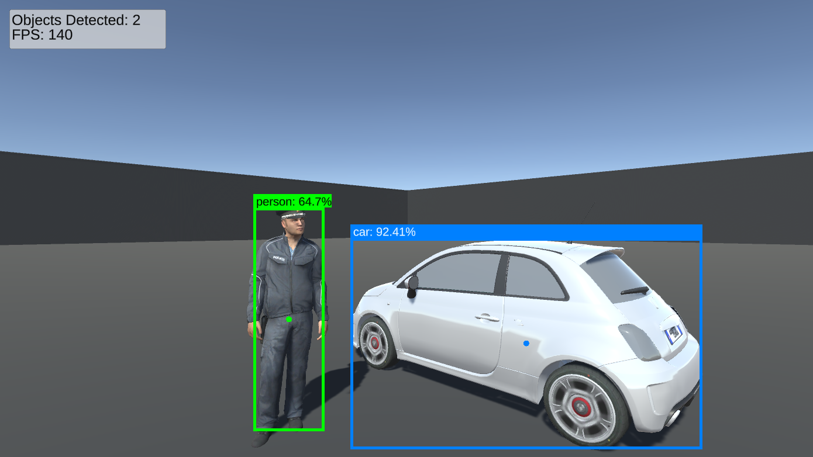

# Barracuda Inference YOLOX Demo BRP
A simple Unity BRP (Built-in Render Pipeline) project demonstrating how to perform object detection with the barracuda-inference-yolox package using the in-game camera.

### Disclaimer

The YOLOX object detection model used in the project is solely for demonstration purposes. Please be aware that it has not been trained to detect in-game objects and may not accurately identify or classify them. This implementation showcases the model's potential integration within Unity, and further training or adjustments may be necessary for specific in-game applications.

### Train a Custom Model

If you're interested in training a YOLOX model on a custom dataset, check out my tutorial tutorial linked below:

- **[Training YOLOX Models for Real-Time Object Detection in Pytorch](https://christianjmills.com/series/tutorials/pytorch-train-object-detector-yolox-series.html)**

### Credits

"Fiat Abarth 500" (https://skfb.ly/oKtX7) by Luquita is licensed under Creative Commons Attribution (http://creativecommons.org/licenses/by/4.0/).

"Police" (https://skfb.ly/6UrnX) by Tech developers is licensed under Creative Commons Attribution (http://creativecommons.org/licenses/by/4.0/).
